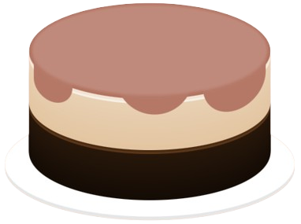
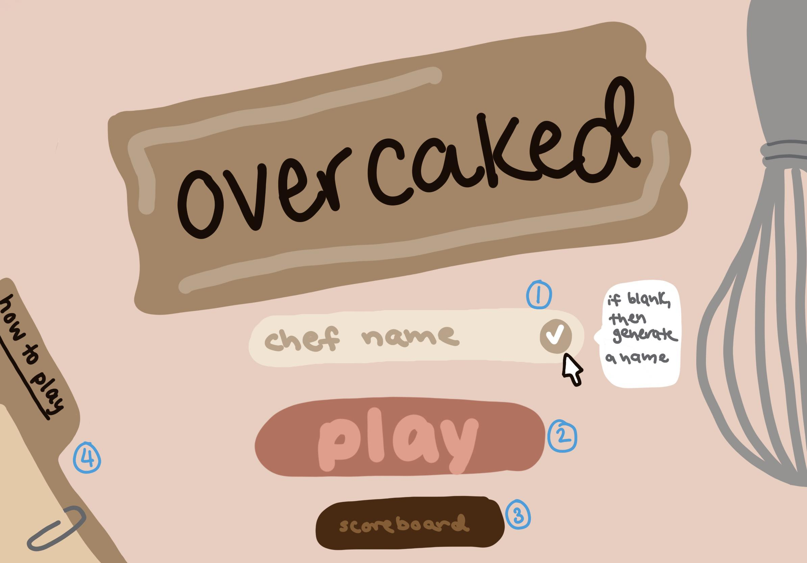
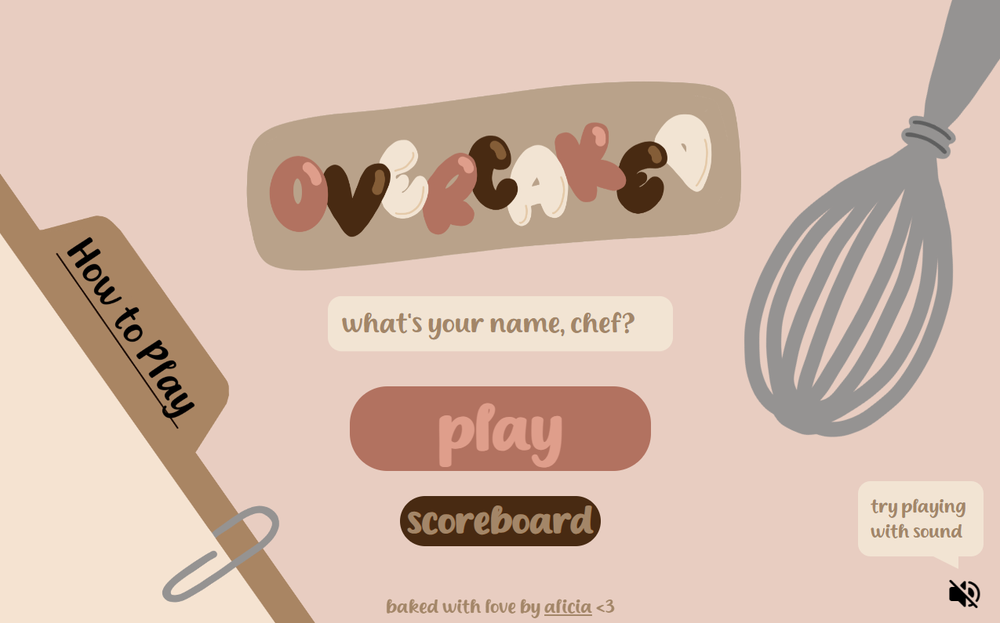
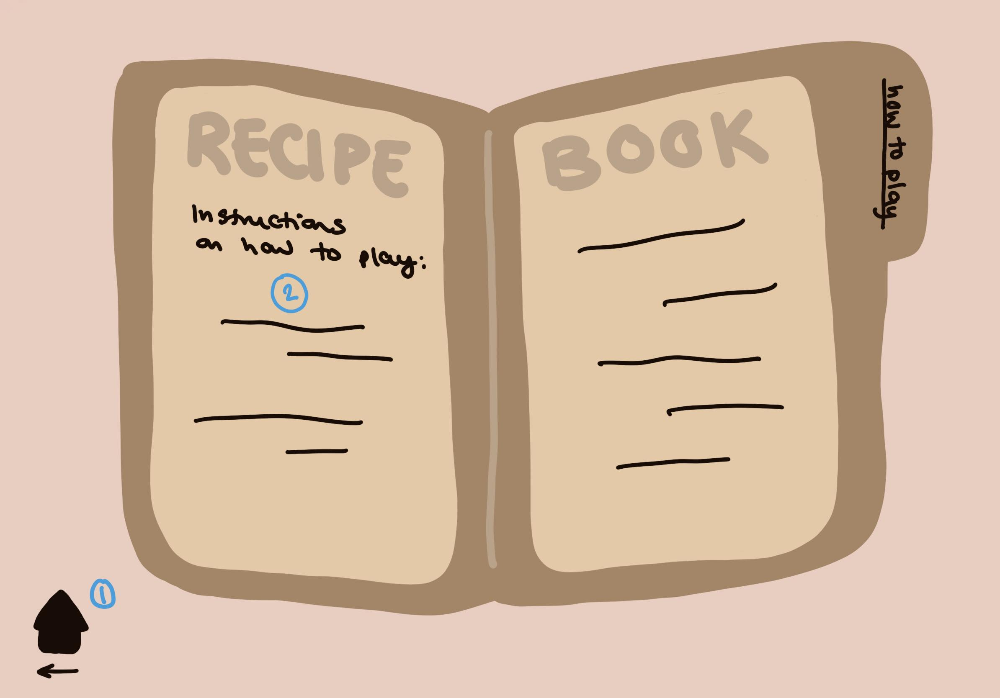
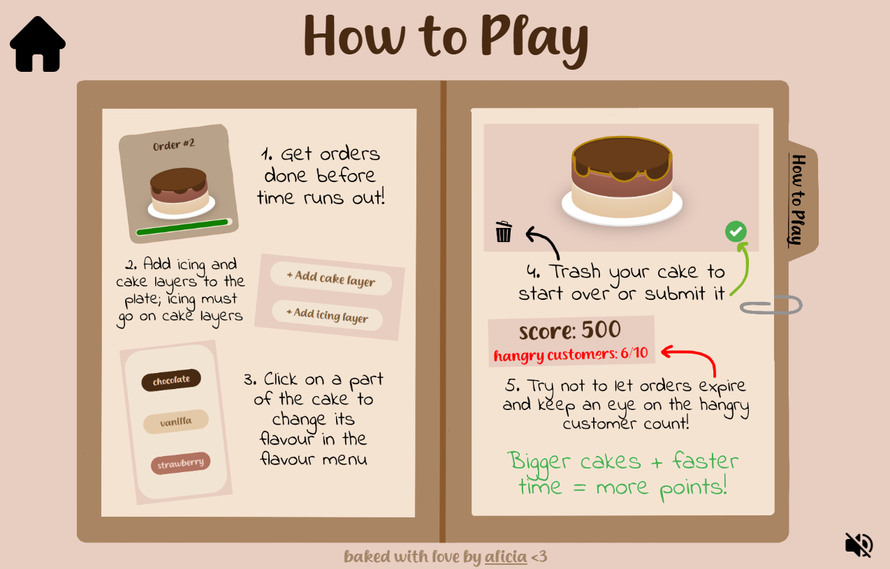
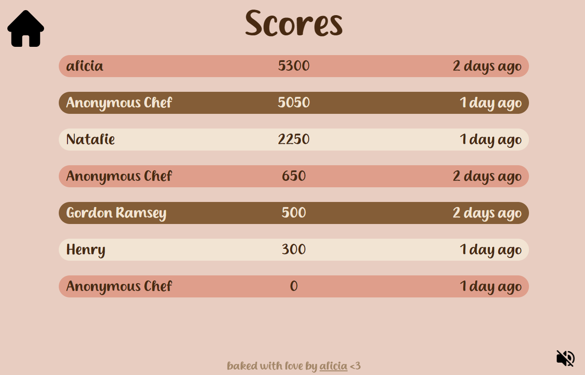
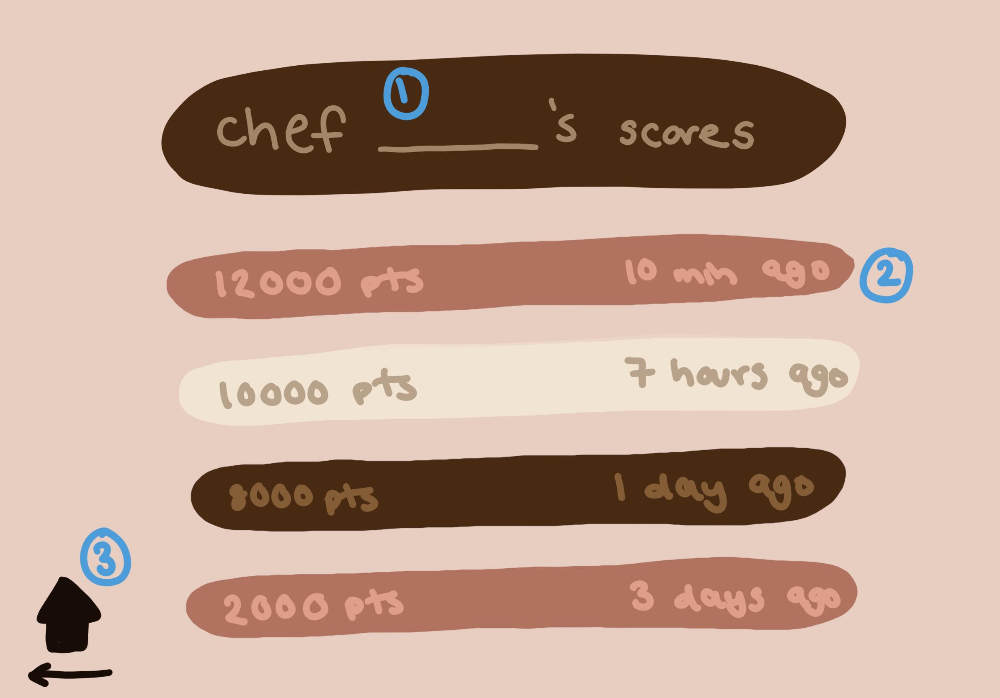
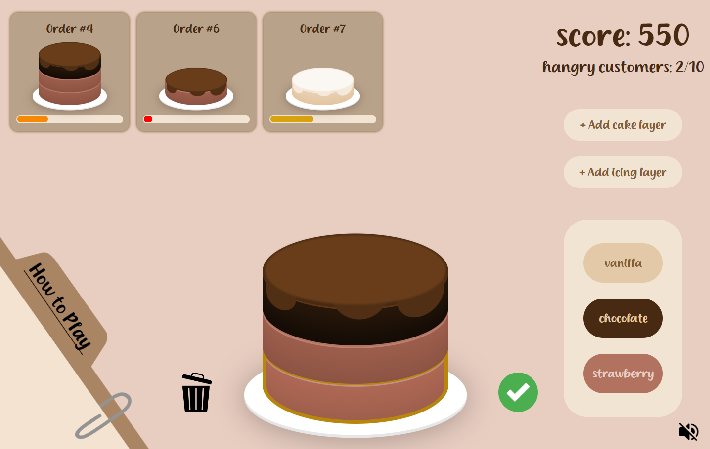
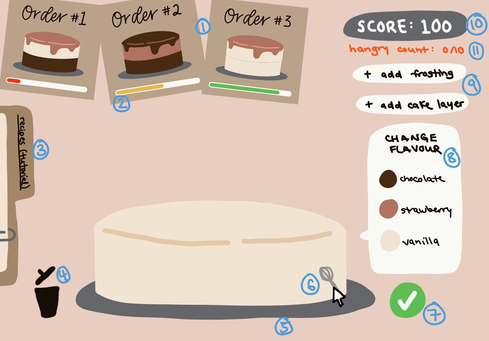

# Overcaked 


## Overview

Welcome to Overcaked! 

<sub>(What do you mean that sounds familiar enough to be a copyright problem?)</sub>

In this game, players are given cake orders from customers and must assemble the cakes correctly before time runs out and customers get hangry! Cakes will have varying numbers of layers, layer flavours, and frosting flavours.

Points are earned for successfully submitted orders and the more complicated the cake, the higher the score awarded.

### Problem Space

**Short answer**: This project is meant to deliver some good silly fun!

**Longer answer**: Everyone needs a pick-me-up every now and then. This project aims to have a cute and cheerful design with a game mechanic that requires just the right amount of concentration - it gives your mind something to do, but is not too frustrating. I hope to bring a smile to someone's face when they play this :)

**Personal answer**: I have been interested in what goes into video game design - especially browser games - for a long time. The scope of this game is modest due to the time constraints, but I'd still like to put my newly learned software skills to use on a project that feels exciting to me. Plus I think the lil cakes are super cute!

### User Profile

I forsee players of the game falling into these categories:

1. Anyone who wants to have something fun and quick to do when taking a break from something more serious on their computer

2. Anyone who likes the idea behind a game like Overcooked but gets frustrated with the more complicated mechanics/higher stress level of that game (I'll admit, I've definitely rage-quit before during family game night)

2. Younger kids who might find this game a bit more challenging than adults. Being able to look at an image and identify the constituent parts and colours, counting cake layers, and assessing visual matches must be good for their young brains' development, right? I have two small nieces so I am super excited to show them this game!

### Features

- Game is responsive at/between/above the following screen size breakpoints (landscape mode):
   - 1024px x 768px
   - 1280px x 800px
   - 1500px x 890px
- Cake card orders will appear on the screen
- Cake orders will have a timer shown through a decreasing bar; once the timer is up, the card will expire and disappear (i.e. player can no longer earn points for completing that specific order)
- Players will be able to add _cake components_ (layers and an icing layer) by pressing buttons on screen as they see fit 
    * A maximum limit will be enforced so that the cake can fit in the screen area; this was decided to be max 3 layers
- Players will be able to customize _cake components_ to have different colours/flavours by pressing buttons on screen
- Players will be able to trash a cake when they want to start over by pressing a button on screen
- Players will be able to submit a cake order when they are satisfied with their work by pressing a button on screen
- Orders do not have to be fulfilled in the order of appearance
- Player score will be tracked and displayed on the screen
- Number of expired cakes will be tracked and displayed on the screen 
    - If the number of expired cakes goes over a limit, the game will end; this was decided to be max 10 missed cakes
- Players can view a game instruction blurb
- Players can see their previous score history
- Players can enter their Chef Name for the scoreboard

 
## Implementation

Please note that some minor changes have been made since the original proposal as the implementation became better defined while working on the project.
### Tech Stack

|   |   |
|---|---|
|__Languages__| HTML, CSS/SASS, Javascript |
|__Front-End__| React, SASS, axios, react-dom, react-router-dom, react-use-precision-timer |
|__Languages__| Node, Express, CORS, uuid, dotenv |
|__Tools & Softwares__| VSCode, Postman, GitHub, Procreate, DaFont, Flaticon |

### APIs

No external sources of data, a custom back-end will be made!

### Sitemap / Mockups vs Final Screenshots

#### Menu Page

 

1. Input for user to enter name (if left blank, a placeholder name will be used)

2. Button to begin game

3. Button to see player's score history

4. Button to show game instructions

---

#### Tutorial Page



1. Home button to return to Menu Page

2. Game instructions

---

#### Scoreboard Page



~~1. Scoreboard title with player's name (player-entered or placeholder)~~

2. Dynamically timestamped scores displayed in order of highest to lowest

3. Home button to return to Menu Page

---

#### Main Page



1. Order cards
2. Timers on orders
3. Tab to show tutorial modal, which looks like tutorial page but smaller and the Main Page is visible in the background
4. Trash icon to scrap cake
5. Plate on which _cake components_ are stacked
6. ~~Clicking on _cake components_ brings up~~ flavour menu to change flavour/colour
7. Checkmark icon to submit cake to be compared against orders
8. Flavour menu
9. Buttons to add _cake components_
10. Player score
11. Tracker for number of failed (timed out) orders; game ends when limit is reached

### Data

1. Pool of flavours cake layers/icing (JSON)
2. Array of randomly generated cake configurations (uses #1) (JSON)
    - Some limits on number of cake layers (max 3)
    - What each cake object looks like:

    ```
    {
        "id": 20,
        "layerCount": 2,
        "layers": ["vanilla", "vanilla"],
        "icing": "chocolate",
        "points": 250
    }
    ```

3. Array of player's past scores and associated timestamps (JSON)
    - When game over, save current score and timestamp of game end to array
        - What each score object looks like:
    ```
    { 
        "id": "74c625c8-79da-47b9-8302-aff05edcb05d",
        "name": "alicia", 
        "score": 5300, 
        "time": 1726802792496 
    }
     ```
4. Store player's name, from front-end input or use placeholder if none provided (localStorage)

### Endpoints

**POST `/cakes`** -> Generates and returns array of cakes

**POST `/cakes/submit`** -> Submits cake to compare to current orders

**GET `/scores`** -> Returns array of scoreboard data

**POST `/scores`** -> Adds new score to scoreboard data


## Roadmap

### Main Chunks & Rough Timeline

0. Get feedback _(Sept 11)_

1. Setting up repo _(Sept 11)_
    - Split into `client` and `server` directories
    - Set default branch to `develop`

2. Collect icon assets (garbage can, checkmark, etc.) _(Sept 11)_

3. Create components in front-end _(Sept 12-14)_
    - Cake layers
    - Icing
    - Plate
    - Order cards
    - Order card timer bar
    - Order card cake images
    - Scoreboard rows
    - Menu page name input
    - Score count
    - Flavour menu

4. Create and route pages in front-end _(Sept 15)_
    - Menu page (`/`)
    - Scoreboard page (`/scoreboard`)
    - Tutorial page (`/howtoplay`)
    - Main page (`/play`)

5. Create data collections in back-end _(Sept 15-16)_
    - List of cake layer/icing flavours
    - Generate array of cakes
    - List of player scores so far
        - Sorted to show highest at the top
        - Use dynamic timestamp

6. Define HTTP verb + endpoint combinations in back-end _(Sept 17)_
    - See **Endpoints** section

7. Make `axios` calls in appropriate places in front-end to get data from back-end _(Sept 18-19)_
    - Clicking PLAY button on Menu Page* triggers generation of array of cakes (decided to limit to 20 cakes in a game)
        - Brings player to `/play`/Main Page
    - Clicking SCOREBOARD button on Menu Page fetches scoreboard data to display
         - Brings player to `/score`/Scoreboard Page
    - Clicking PLAY button on Menu Page writes inputted Chef Name to localStorage
        - If field is blank, use placeholder name ("Anonymous Chef")

8. Create event listeners in front-end to respond to player actions (see #7 for event listeners that have to do with back-end data) _(Sept 19-21)_
    - On Menu Page
        - Clicking on **Tutorial tab** takes player to `/howtoplay`/Tutorial page
    - On Main Page
        - Clicking **+ Add Cake Layer** button adds cake layer
        - Clicking **+ Add Icing** button adds icing to top
        - Clicking **trash icon** scraps everything on the plate
        - Clicking **checkmark icon** submits the cake to check against the cake orders currently on screen
            - If a match is found, add that's order's cake's `score` property to player's score
            - If not match is found, feedback is given to user (shaking of the plate) so they know the cake submission was wrong
        - Clicking on **Tutorial tab** takes player to `/howtoplay`/Tutorial page
    - On Scoreboard Page
        - Clicking on **home icon** brings user back to `/`/Menu page
    - On Tutorial Page
        - Clicking on **home icon** brings user back to `/`/Menu page

9. Testing _(Sept 22)_

## How to Run Locally

1. Clone this repo locally
2. Run `npm install` in both the `overcaked-front-end` and `overcaked-back-end` directories
    - **Optional**: Add a `.env` file to the `overcaked-back-end` directory and set the `PORT` to 8080 (the `.env.sample` file shows the format)
        - The port is set automatically if this file is not added, please do not change it to be anything other than 8080 at this time
3. Run `node --watch index.js` in the `overcaked-back-end` directory
4. Run `npm run dev` in the `overcaked-front-end` directory
5. Open `http://localhost:5173/` in Chrome


## Nice to Haves/Future Features

✅ = Included at time of submission

- ✅ Add cheerful music that plays in window
- ✅ Animations
    - ✅ Title logo idle pulse
    - ✅ Menu page whisk moves on hover
    - ✅ Interactable items enlarge on hover (hand pointer cursor to show clickable)
    - ✅ Articles/cards enlarge when hover (regular cursor)
    - ✅ Order cards slide into page
    - ✅ Plate shakes when invalid action happens
    - ✅ Score and expired cake count text pops out and changes colour 
    - ✅ Pop up on menu page reminds player to try playing with sound on
    - Cake box animation for successful submissions
- ✅ Custom themed cursors
- ✅ Visually displaying which _cake component_ is selected (selection border)
- ✅ Pause timers when tutorial modal is open and resume when modal is closed (used https://www.npmjs.com/package/react-use-precision-timer)
- ✅ Use GIF for playthrough instructions
- ✅ Highlight and scroll to newly added score when view scoreboard page from end of game
- ✅ Add a reminder to players if their screens are too small/wrong orientation
- Add symbols on flavours (instead of just relying on colours) to increase accessibility
- Different levels of difficulty (timers shorter/number of concurrent orders increases, etc.)
- Deploy online
    - Save scoreboard data for online players
- Expand colours/flavours/number of cake layers, add cake toppings (increase cake order complexity)
- Save data in database instead of JSON file
- Have back-end store names to randomly generate if player does not give a name
    - Example: Have array of adjectives and array of nouns, randomly pick one of each to give a name, ex. "Frosted Baker"
- Mobile compatibility


## Acknowledgements

"Milk Cream" Font (via DaFont): https://www.dafont.com/milk-cream.font by MJtype

"Yummy Flavor" Music (copyright free): https://www.youtube.com/watch?v=tAaFg2u-i2c by UmbrTone

CSS Cake Model (modified): https://codepen.io/fazlurr/pen/gPMJMK by Fazlur Rahman on CodePen

Icon Attributions:

- Checkmark - https://www.flaticon.com/authors/kliwir-art
- Trash can - https://www.flaticon.com/authors/lakonicon
- House - https://www.flaticon.com/authors/freepik
- Volume off - https://www.flaticon.com/authors/fach
- Volume on - https://www.flaticon.com/authors/fach
- Chef hat cursor - https://www.flaticon.com/authors/those-icons
- Whisk cursor - https://www.flaticon.com/authors/popo2021
- Hand cursor (modified) - https://www.flaticon.com/authors/meaicon

Special thanks to Carmela and William, the first ever players, who helped find all the ways to break the code :)

Original graphics by me! (Drawn on Procreate)

---

#### Temp Note
On the day of submission, a bug that I thought was squashed earlier reappeared. 
Investigation is ongoing, but in the meantime, here is everything I know about it:
- Sometimes cake expiry behaviour is weird 
    - It seems that the main symptom is 1-layer cakes sometimes do not clear away when they are expired
    - Sometimes they will seem to hang for a bit and then clear away after a couple seconds
    - Sometimes the expiry of another cake seems to trigger its expiry as well
- I can't consistently reproduce the issue but it seems to go away when instead of randomly generating cakes, an unchanging `cakes.json` is used
    - If I cannot figure the bug out, I will use a static cake JSON file on Demo Day to be safe
- Next parts of the investigation will entail:
    - Seeing if new cakes are generated when they aren't expected to be
    - Trying attaching the generation of cakes to the action of pressing the PLAY button the Menu Page instead of loading into the Play Page
    - A lot of console logging

Take a look at the `mystery-bug` branch if you'd like! 

Running from that branch instead of `main` will most likely yield more stable cake expiry behaviour, but the cakes will not be randomly generated every time.

<sub>pray for me</sub>
